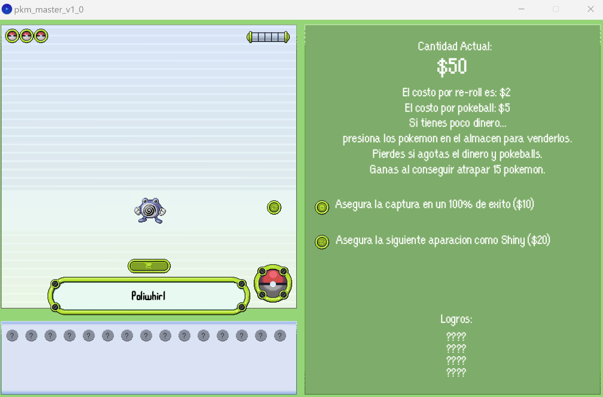
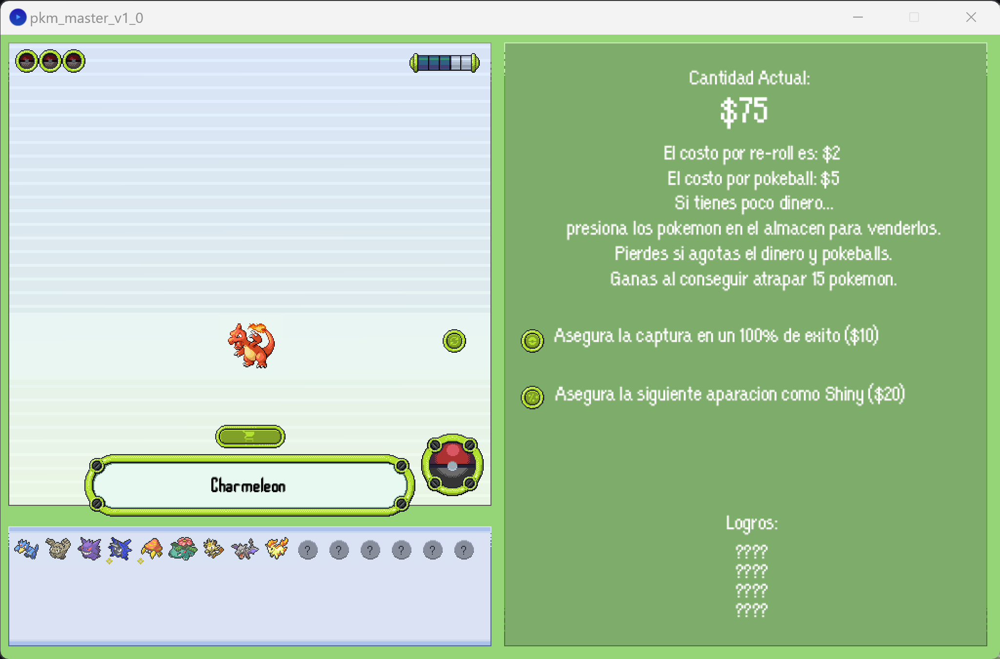
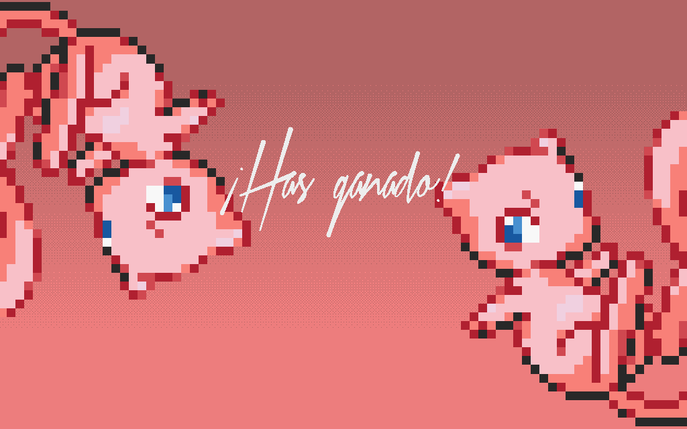
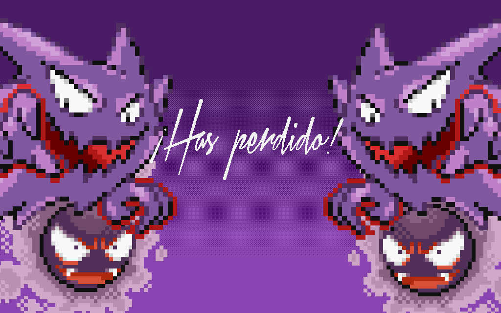

# Pkmn Finder: Gotta Catch 'Em All to Pay the Bills!
As a seasoned Pokémon trainer drowning in bills, you're no longer just playing around. It's time to level up and tackle your financial woes head-on. Welcome to Pkmn Finder, where you'll embark on a thrilling journey to capture Pokémon and rake in the cash. Remember, the shinies pay more, so keep your eyes peeled for those elusive treasures. It's time to hustle, pay your rent, and show the world what you're made of!\
*(Spanish version only)*

## Screenshots

  
Gameplay screenshots

    
    

  
Winner splash

    

  
Loser splash

    

## Features
- Shiny spawn
- Extra money for every fifth catch
- Reroll pkmn
- 100% catch rate button (catch guaranteed button)
- 100% spawn rate button (shiny button: the next pkmn will we shiny)
- cart shop button to buy more pokeballs
- remove stored pkmns
- Achievements (The achievements will be display -if you have earned one- when you win the game)
- Auto save (create a save file to store the earned achivements)

## How to play
- Download [Processing!](https://processing.org/)
- Download the files from this repo
- Run Processing app
- File > Open > Search for the pde file called "pkm_master_v1_0.pde"
- Hit the play button, and have fun.

This mini game was just for fun, so feel free to download it and modify any aspect of the game, add more pkmns, increase the difficulty, increase the number of achievements or anything you want. great catches!
